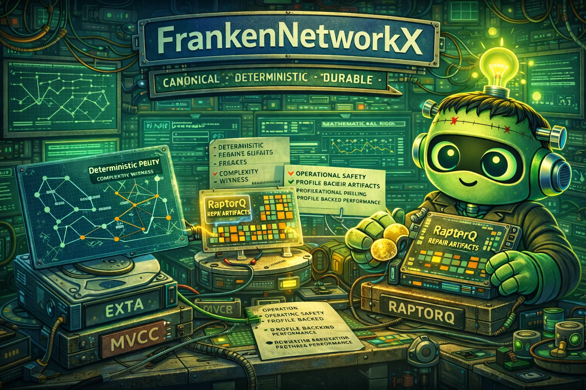

# FrankenNetworkX

  

FrankenNetworkX is a clean-room Rust reimplementation targeting grand-scope excellence: semantic fidelity, mathematical rigor, operational safety, and profile-proven performance.

## What Makes This Project Special

Canonical Graph Semantics Engine (CGSE): deterministic tie-break policies with complexity witness artifacts per algorithm family.

This is treated as a core identity constraint, not a best-effort nice-to-have.

## Methodological DNA

This project uses four pervasive disciplines:

1. alien-artifact-coding for decision theory, confidence calibration, and explainability.
2. extreme-software-optimization for profile-first, proof-backed performance work.
3. RaptorQ-everywhere for self-healing durability of long-lived artifacts and state.
4. frankenlibc/frankenfs compatibility-security thinking: strict vs hardened mode separation, fail-closed compatibility gates, and explicit drift ledgers.

## Current State

- project charter docs established.
- legacy oracle cloned:
  - `/dp/franken_networkx/legacy_networkx_code/networkx`
- FrankenSQLite exemplar spec copied locally:
  - `reference_specs/COMPREHENSIVE_SPEC_FOR_FRANKENSQLITE_V1.md`
- first executable vertical slice landed:
  - deterministic graph core (`fnx-classes`),
  - strict/hardened runtime + evidence ledger (`fnx-runtime`),
  - unweighted shortest path + complexity witness (`fnx-algorithms`),
  - fixture-driven conformance harness (`fnx-conformance`).
- second vertical slice landed:
  - deterministic dispatch routing (`fnx-dispatch`),
  - conversion routes (`fnx-convert`),
  - edgelist parser/writer (`fnx-readwrite`),
  - RaptorQ sidecar + scrub/decode drill pipeline (`fnx-durability`).
- third vertical slice landed:
  - live/cached view semantics with revision invalidation (`fnx-views`),
  - JSON graph read/write path (`fnx-readwrite`),
  - oracle-generated view/JSON fixtures (`fnx-conformance`),
  - percentile benchmark gate with durability sidecars (`scripts/run_benchmark_gate.sh`).
- fourth vertical slice landed:
  - deterministic connected-components and component-count witnesses (`fnx-algorithms`),
  - deterministic (`empty/path/star/cycle/complete`) + seeded graph generators with strict/hardened guards (`fnx-generators`),
  - oracle-generated components/generators fixtures (`fnx-conformance`),
  - expanded drift-free conformance corpus (12 fixtures) with durability artifacts.
- fifth vertical slice landed:
  - deterministic degree-centrality with complexity witness (`fnx-algorithms`),
  - cycle-graph edge-order parity tightening for larger `n` (`fnx-generators`),
  - oracle-generated degree-centrality fixture + stronger cycle fixture (`fnx-conformance`),
  - expanded drift-free conformance corpus (13 fixtures) with durability artifacts.
- sixth vertical slice landed:
  - deterministic closeness-centrality with WF-improved semantics (`fnx-algorithms`),
  - conformance operation/schema support for closeness centrality (`fnx-conformance`),
  - oracle-generated closeness-centrality fixture (`fnx-conformance`),
  - expanded drift-free conformance corpus (14 fixtures) with durability artifacts.
- seventh vertical slice landed:
  - deterministic minimum-cut surface paired with the existing Edmonds-Karp max-flow path (`fnx-algorithms`),
  - conformance operation/schema support for `minimum_cut_query` (`fnx-conformance`),
  - oracle-anchored minimum-cut strict fixture (`fnx-conformance`),
  - expanded drift-free conformance corpus (16 fixtures) with durability artifacts.

## V1 Scope

- Graph, DiGraph, MultiGraph core semantics; - shortest path/components/centrality/flow scoped sets; - serialization core formats.

## Architecture Direction

graph API -> graph storage -> algorithm modules -> analysis and serialization

## Compatibility and Security Stance

Preserve NetworkX-observable algorithm outputs, tie-break behavior, and graph mutation semantics for scoped APIs.

Defend against malformed graph ingestion, attribute confusion, and algorithmic denial vectors on adversarial graphs.

## Performance and Correctness Bar

Track algorithm runtime tails and memory by graph size/density; gate complexity regressions for adversarial classes.

Maintain deterministic graph semantics, tie-break policies, and serialization round-trip invariants.

## Key Documents

- AGENTS.md
- COMPREHENSIVE_SPEC_FOR_FRANKENNETWORKX_V1.md

## Next Steps

1. Expand fixture corpus to larger legacy families for matching and additional centrality variants.
2. Expand flow-family coverage beyond max-flow + min-cut (directed semantics hardening, larger adversarial flow fixtures, and stress fixtures).
3. Add format breadth beyond edgelist/json (adjlist/graphml scoped paths).
4. Add benchmark families and p50/p95/p99 regression gates across centrality and flow workloads.
5. Tighten strict/hardened drift budgets with per-family parity thresholds.

## Porting Artifact Set

- PLAN_TO_PORT_NETWORKX_TO_RUST.md
- EXISTING_NETWORKX_STRUCTURE.md
- PROPOSED_ARCHITECTURE.md
- FEATURE_PARITY.md

These four docs are now the canonical porting-to-rust workflow for this repo.
